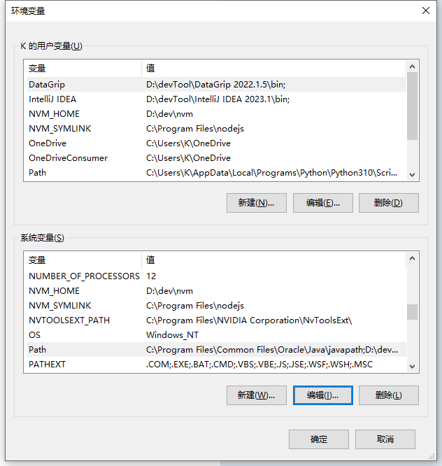
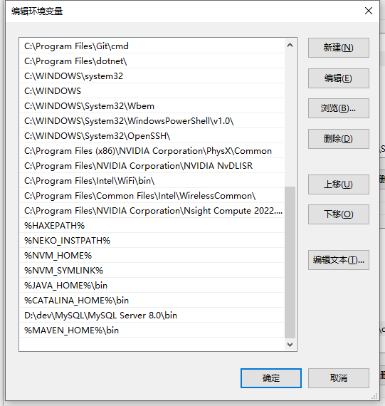

::: tip 介绍

NVM（Node Version Manager）是一个用于管理 Node.js 版本的工具，它允许你在同一台计算机上轻松地安装、切换和管理多个 Node.js 版本。

以下是一些关于 NVM 的要点：

1. 多版本管理：NVM 允许你同时安装和管理多个 Node.js 版本。你可以在同一台计算机上拥有不同版本的 Node.js，并且可以轻松切换它们，以适应不同的项目和需求。

2. 快速切换：通过 NVM，你可以在不同的终端会话中快速切换 Node.js 版本。这使你能够在不同的项目之间无缝切换，而无需手动更改全局的 Node.js 版本。

3. 简单安装：NVM 提供了一个方便的安装脚本，使你可以快速安装 NVM 工具。安装过程简单，并且可以在不同的操作系统上使用，包括 macOS、Linux 和 Windows。

4. 版本管理：通过 NVM，你可以安装特定版本的 Node.js，包括稳定版本、最新版本或特定的 LTS（长期支持）版本。你还可以安装和使用旧版本的 Node.js，以确保项目的兼容性和稳定性。

5. 自定义设置：NVM 允许你自定义 Node.js 的全局和项目级别的默认版本。你可以选择在不同的项目中使用不同的 Node.js 版本，并为每个项目设置特定的默认版本。

6. 插件扩展：NVM 具有插件系统，可以使用插件来扩展其功能。这些插件提供了额外的功能和工具，例如自动切换 Node.js 版本、版本别名、自动安装所需的全局包等。

通过使用 NVM，你可以更轻松地管理和切换不同版本的 Node.js，确保你的项目与所需的 Node.js 版本兼容，并提高开发和测试的灵活性。它是 Node.js 开发者常用的工具之一，可以提高开发效率和项目的可维护性。
:::

::: warning 注意
1. 安装之前，如果之前已经安装了Node.js 必须先卸载之前安装的Node.js
2. 安装的路径中不能是 中文或者含有空格等特殊符号 的路径
:::

## 下载、安装nvm
### Linux版
[Linux版本下载地址](https://github.com/nvm-sh/nvm/releases)
### Windows版
[Windows版本下载地址](https://github.com/coreybutler/nvm-windows/releases)
下载完成后，正常安装流程执行
#### 检查是否成功安装

```shell
nvm -v
```
如果正确显示了版本号，则视为成功
## 修改配置文件

找到安装的根目录的 `settings.txt` 文件，设置镜像

```javascript
node_mirror: https://npm.taobao.org/mirrors/node/
npm_mirror: https://npm.taobao.org/mirrors/npm/
```

## 配置环境变量
打开系统的高级系统设置 -> 环境变量
NVM_HOME 即可



## 安装Node.js
打开cmd，在命令行中输入以下命令
```shell
nvm install <version>
nvm install 18
```
version指要安装的版本
如果不指定版本，可以使用以下命令来安装最新的稳定版本的 Node.js
```shell
nvm install --lts
# or
nvm install node
```
## 使用/切换Node.js的版本
```shell
# 查看已安装的版本
nvm ls

nvm use <version>
```
这里的 `<version>` 也可以去nvm的根目录查看，不同的版本以不同版本号命名的文件夹
## 卸载Node.js
```shell
# 首先，使用以下命令查看已安装的 Node.js 版本和路径
nvm list
# 确定想要卸载的特定版本，并使用以下命令卸载该版本
nvm uninstall <version>

nvm uninstall 18
```
## 常用命令
```shell
# 查看远程 Node 所有版本
nvm ls-remote 
# 查看远程 Node 所有 LTS 版本
nvm ls-remote --lts 
# 查看本地 Node 版本
nvm ls 
# 查看当前使用 Node 版本
nvm current 
# 查看 node 安装位置
nvm which 14 
```
