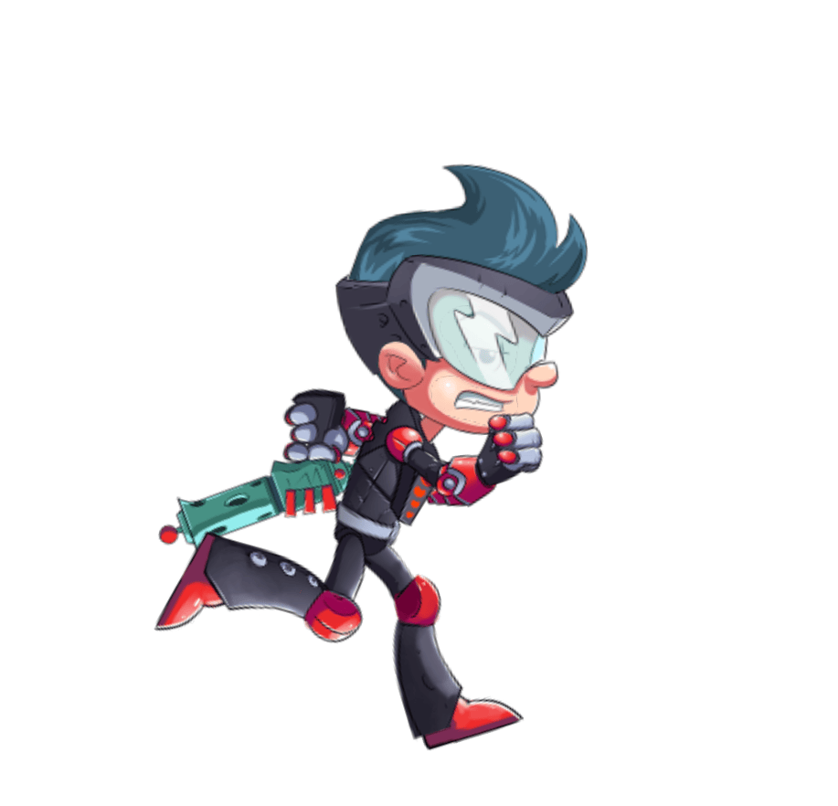
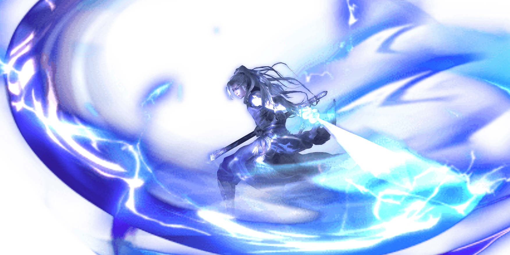

## 前言
为什么选择使用spine骨骼动画？因为它是当前最好的选择。
需要提前了解的，spine骨骼动画是由三个部分文件组成
1. **骨骼数据文件** (.json、.skel)
2. **纹理图集文件** (.atlas)
3. **图像文件** (.png)

以上文件缺一不可。
直接进入正题。
## 下载、安装
全篇是以spine-runtime 3.6版本为讲解，更高的版本 使用方式会不同 注意甄别
- [releases目录](https://github.com/EsotericSoftware/spine-runtimes/releases)，找到3.6.53 并下载解压
- 进入解压后的文件夹，你会看到很多语言、游戏引擎平台的各个版本，由于我们是前端网页环境，所以我们选spine-ts,进入后会看到`canvas`、`threejs`、`webgl`、`widget` 这些是以什么样的环境去运行spine，这里我选择webgl(因为性能最好)，进入这个文件夹后 会发现很多官方示例建议去看看，会对接下来的操作有所理解。
- 选择webgl环境，须知以下条件
    1. 浏览器版本是否足够高，最好选择Chrome或Edge浏览器，IE请不要选择
    2. 手机环境的webview版本是否足够高？最好是>=91
## 编码
- 当前路径`spine-runtimes-3.6.53\spine-ts\webgl\example`，在这个目录下 新建一个xxx.html (随意取文件名)，使用IDE打开(我使用的是webstrom，你可以选择vscode)
- 在head内引入spine运行库文件，下面是全部的代码，演示的是官方的json动画


```html
<!DOCTYPE html>  
<html lang="zh">  
<head>  
  <meta charset="UTF-8">  
  <title>Title</title>  
  <script src="spine.js"></script>  
  <style>  
      * {  
          margin: 0;  
          padding: 0;  
      }  
  
      body,  
      html {  
          height: 100%  
      }  
  
      canvas {  
          position: absolute;  
          width: 100%;  
          height: 100%;  
          transform: translate3d(0, 0, 0);  
      }  
  </style>  
</head>  
<body>  
<script>  
  var canvas, gl, shader, batcher, skeletonRenderer, assetManager;  
  var filepath = "assets/";  
  var filename = "spineboy";  
  var sprite = {};  
  // m = 模型(model) v = 视图(view) p = 投影(projection) 矩阵  
  var mvp = new spine.webgl.Matrix4();  
  
  function init() {  
    // 创建canvas元素,并设置其宽高与窗口相同,然后将canvas元素添加到body中  
    canvas = document.createElement("canvas");  
    canvas.width = window.innerWidth;  
    canvas.height = window.innerHeight;  
    document.body.appendChild(canvas);  
  
    // 创建WebGL上下文, 设置alpha属性为true,以允许透明度  
    var config = {alpha: true};
    // 这里我选择使用webgl2
    gl = canvas.getContext('webgl2', config);  
    // 也可以选择这样  
    // gl = canvas.getContext("webgl", config) || canvas.getContext("experimental-webgl", config);  
  
    // 初始化Spine运行时  
    // 着色器  
    shader = spine.webgl.Shader.newTwoColoredTextured(gl);  
    // 多边形渲染器  
    batcher = new spine.webgl.PolygonBatcher(gl);  
    mvp.ortho2d(0, 0, canvas.width - 1, canvas.height - 1);  
    // 骨骼渲染器  
    skeletonRenderer = new spine.webgl.SkeletonRenderer(gl);  
  
    // 资源管理器，第二个参数可以传 默认的资源路径  
    assetManager = new spine.webgl.AssetManager(gl);  
  
    // 加载资源  
    // 这里面的资源是官方自带的  
    assetManager.loadText(filepath + filename + '-ess.json');  
    // 如果是.skel 文件则调用loadBinary  
    // assetManager.loadBinary(filepath + filename + '.skel');  
    // 这个方法会将.atlas文件内相关的图片文件一并加载到管理器中  
    assetManager.loadTextureAtlas(filepath + filename + '.atlas');  
  
    requestAnimationFrame(load);  
  }  
  
  
  function load() {  
    // io的操作是异步的 需要全部资源加载完毕后 再加载骨骼  
    if (assetManager.isLoadingComplete()) {  
      sprite = loadSkeleton(filename + '-ess', "run", false);  
      requestAnimationFrame(render);  
    } else {  
      requestAnimationFrame(load);  
    }  
  }  
  
  // 加载骨架函数，name为文件名，initialAnimation为初始动画，premultipliedAlpha为预乘alpha，skin为皮肤  
  function loadSkeleton(name, initialAnimation, premultipliedAlpha, skin) {  
    // 如果skin未定义，则设置skin为默认皮肤  
    if (skin === undefined) skin = "default";  
    // 通过assetManager获取骨骼图集  
    var atlas = assetManager.get(filepath + filename + ".atlas");  
    // 创建AtlasAttachmentLoader，用于加载骨骼图集中的附件  
    var atlasLoader = new spine.AtlasAttachmentLoader(atlas);  
    // 使用AtlasAttachmentLoader创建SkeletonJson，用于解析骨骼数据  
    var skeletonJson = new spine.SkeletonJson(atlasLoader);  
    // 如果是skel文件 使用 let skeletonBinary = new spine.SkeletonBinary(atlasLoader);
    // 读取骨骼数据文件，获取骨骼数据  
    var skeletonData = skeletonJson.readSkeletonData(assetManager.get(filepath + name + ".json"));  
    // 创建骨骼对象，使用骨骼数据  
    var skeleton = new spine.Skeleton(skeletonData);  
  
    skeleton.opacity = 1;  
    // 设置骨骼的皮肤  
    skeleton.setSkinByName(skin);  
    // 设置骨骼的姿势  
    skeleton.setToSetupPose();  
    // 更新骨骼的世界变换  
    skeleton.updateWorldTransform();  
    // 初始化骨骼的边界框  
    skeleton.bounds = {offset: new spine.Vector2(), size: new spine.Vector2()};  
    skeleton.getBounds(skeleton.bounds.offset, skeleton.bounds.size, []);  
  
    // 根据骨骼数据创建骨骼动画状态，并使用 initialAnimation 参数作为初始要播放的动画  
    skeleton.state = new spine.AnimationState(new spine.AnimationStateData(skeleton.data));  
    skeleton.state.setAnimation(0, initialAnimation, true);  
    return {skeleton, state: skeleton.state, bounds: skeleton.bounds, premultipliedAlpha}  
  }  
  
  var frameTime = undefined;  
  var isBind;  
  
  function render(timestamp) {  
    var delta = timestamp - ((frameTime == undefined) ? timestamp : frameTime);  
    frameTime = timestamp;  
  
    // 更新 MVP 矩阵以调整画布大小  
    resize();  
  
    gl.clearColor(0, 0, 0, 0);  
    gl.clear(gl.COLOR_BUFFER_BIT);  
  
    // 根据增量时间更新动画状态  
    var state = sprite.state;  
    var skeleton = sprite.skeleton;  
    var bounds = sprite.bounds;  
  
    state.update(delta / 1000);  
    state.apply(skeleton);  
    skeleton.updateWorldTransform();  
  
    if (!isBind) {  
      // 绑定着色器并设置纹理和mvp矩阵。  
      // 如果没有unbind() 则不需要重复bind
      isBind = true;
      shader.bind();  
      shader.setUniformi(spine.webgl.Shader.SAMPLER, 0);  
    }  
  
    shader.setUniform4x4f(spine.webgl.Shader.MVP_MATRIX, mvp.values);  
  
    // 启动 batcher 并告诉 SkeletonRenderer 渲染要播放骨骼。  
    batcher.begin(shader);  
  
    skeletonRenderer.premultipliedAlpha = sprite.premultipliedAlpha;  
    skeletonRenderer.draw(batcher, skeleton);  
    batcher.end();  
  
    // shader.unbind();  
  
    requestAnimationFrame(render);  
  }  
  
  // 在render中调用，保证屏幕变化时 骨骼也能正确显示  
  function resize() {  
    var w = canvas.clientWidth;  
    var h = canvas.clientHeight;  
    var bounds = sprite.bounds;  
    if (canvas.width != w || canvas.height != h) {  
      canvas.width = w;  
      canvas.height = h;  
    }  
  
    // 让其骨骼始终居中，大小保持合适  
    var centerX = bounds.offset.x + bounds.size.x / 2;  
    var centerY = bounds.offset.y + bounds.size.y / 2;  
    var scaleX = bounds.size.x / canvas.width;  
    var scaleY = bounds.size.y / canvas.height;  
    var scale = Math.max(scaleX, scaleY) * 1.2;  
    if (scale < 1) scale = 1;  
    var width = canvas.width * scale;  
    var height = canvas.height * scale;  
  
    mvp.ortho2d(centerX - width / 2, centerY - height / 2, width, height);  
    gl.viewport(0, 0, canvas.width, canvas.height);  
  }  
  
  init();  
</script>  
</body>  
</html>
```
## 成果



<script>
  console.log(1)
</script>